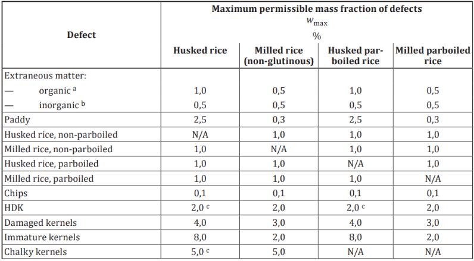

# Cereals and pulses — Specification and test methods

## FOREWORD
>This section is non-normative

ISO (the International Organization for Standardization) is a worldwide federation of national standards bodies (ISO member bodies). The work of preparing International Standards is normally carried out through ISO technical committees. Each member body interested in a subject for which a technical committee has been established has the right to be represented on that committee. International organizations, governmental and non-governmental, in liaison with ISO, also take part in the work. ISO collaborates closely with the International Electrotechnical Commission (IEC) on all matters of electrotechnical standardization. 

The procedures used to develop this document and those intended for its further maintenance are described in the ISO/IEC Directives, Part 1. In particular, the different approval criteria needed for the different types of ISO documents should be noted. This document was drafted in accordance with the editorial rules of the ISO/IEC Directives, Part 2 (see [www.iso.org/directives](https://www.iso.org/directives)). 

ISO draws attention to the possibility that the implementation of this document may involve the use of (a) patent(s). ISO takes no position concerning the evidence, validity or applicability of any claimed patent rights in respect thereof. As of the date of publication of this document, ISO had not received notice of (a) patent(s) which may be required to implement this document. However, implementers are cautioned that this may not represent the latest information, which may be obtained from the patent database available at www.iso.org/patents. ISO shall not be held responsible for identifying any or all such patent rights. 

Any trade name used in this document is information given for the convenience of users and does not constitute an endorsement. 

For an explanation of the voluntary nature of standards, the meaning of ISO specific terms and expressions related to conformity assessment, as well as information about ISO's adherence to the World Trade Organization (WTO) principles in the Technical Barriers to Trade (TBT), see www.iso.org/iso/foreword.html. 

This document was prepared by Technical Committee ISO/TC 34, Food products, Subcommittee SC 4, Cereals and pulses. 

This third edition cancels and replaces the second edition (ISO 17301-1:2016), which has been technically revised. 

The main changes are as follows:   
— updating of normative references;   
— revision of Clause 9. 

A list of all parts in the ISO 17301 series can be found on the ISO website. 

Any feedback or questions on this document should be directed to the user’s national standards body. A complete listing of these bodies can be found at www.iso.org/members.html.

## INTRODUCTION
>This section is non normative

This document was developed in response to worldwide demand for minimum specifications for rice traded internationally, since most commercial bulks of grain, which have not been screened or aspirated, contain a proportion of other grains, weed seeds, chaff, straw, stones, sand, etc. The vegetable materials can have physical and biological properties which differ from those of the main constituent and can therefore affect the storage behaviour.

Rice is a permanent host to a considerable microflora; most of these microorganisms are cosmopolitan, the majority are innocuous, but some produce harmful by-products. Microflora communities present on freshly harvested rice include many types of bacteria, moulds and yeasts. While the rice is ripening and its moisture content is falling, the number of field microorganisms, mainly bacteria, diminishes. When the rice is harvested, it is invaded by storage microorganisms and the field microflora gradually die out. If the mass fraction of moisture (formerly expressed as moisture content) is less than 18 %, the microflora does not multiply, whereas above 18 % it does so rapidly. Thus, at harvest, the qualitative and the quantitative composition of the microflora depends more upon ecological factors than upon the variety of the rice. During transport and storage, additions to the microfloral population occur. Microorganisms on the rice at harvest tend to die out during storage and are replaced by microorganisms adapted to storage conditions.

Storage losses have been estimated as being an average of 5 %, and as much as 30 %, especially in regions with climates favourable to the rapid development of agents of deterioration, such as tropical climates. The magnitude of these figures highlights the need to promote a rapid improvement in techniques of conservation worldwide.

## SCOPE
### General Scope
>This section is normative

This document specifies minimum requirements and test methods for rice (Oryza sativa L.). It is applicable to husked rice, husked parboiled rice, milled rice and milled parboiled rice, suitable for human consumption, directly or after reconditioning. It is not applicable to cooked rice product.

### Conformance and Notations
>This section is normative

If sections are marked as non-normative, all authoring guidelines, diagrams, examples, and notes in these sections are non-normative. Everything else in this specification is normative.

The key words MAY, MUST, MUST NOT, OPTIONAL, RECOMMENDED, REQUIRED, SHOULD and SHOULD NOT in this document are to be interpreted as described in \[[__BCP 14__](https://www.rfc-editor.org/info/bcp14)\],  \[[__RFC2119__](https://www.w3.org/TR/did-1.0/#bib-rfc2119)\], \[[__RFC8174__](https://www.w3.org/TR/did-1.0/#bib-rfc8174)\] when, and only when, they appear in all capitals, as shown here.

## NORMATIVE REFERENCES
>This section is normative

The following documents are referred to in the text in such a way that some or all of their content constitutes requirements of this document. For dated references, only the edition cited applies. For undated references, the latest edition of the referenced document (including any amendments) applies. 

**\[RFC2119**\] Bradner, S., \["Key words for use in RFCs to Indicate Requirement Levels"\], BCP 14, RFC 2119, March 1997. [__https://www.rfc-editor.org/info/rfc2119__](https://www.rfc-editor.org/info/rfc2119)

**\[RFC8174\]** Leiba, B., "Ambiguity of Uppercase vs Lowercase in RFC 2119 Key Words", BCP 14, RFC 8174, May 2017. [__https://www.rfc-editor.org/info/rfc8174__](https://www.rfc-editor.org/info/rfc8174)

**\[ISO 712\]**, Cereals and cereal products — Determination of moisture content — Reference method 

**\[ISO 6646\]**, Rice — Determination of the potential milling yield from paddy and from husked rice 

**\[ISO 8351-1:1994\]**, Packaging — Method of specification for sacks — Part 1: Paper sacks 

**\[ISO 8351-2\]**, Packaging — Method of specification for sacks — Part 2: Sacks made from thermoplastic flexible film 

**\[ISO 16634-2:2016\]**, Food products — Determination of the total nitrogen content by combustion according to the Dumas principle and calculation of the crude protein content — Part 2: Cereals, pulses and milled cereal products 

**\[ISO 20483:2013\]**, Cereals and pulses — Determination of the nitrogen content and calculation of the crude protein content — Kjeldahl method 

**\[ISO 24333:2009\]**, Cereals and cereal products — Sampling

## TERMS & DEFINITIONS

For the purposes of this document, the following terms and definitions apply.   
ISO and IEC maintain terminology databases for use in standardization at the following addresses: 

— ISO Online browsing platform: available at <https://www.iso.org/obp>   
— IEC Electropedia: available at <https://www.electropedia.org/>

**paddy**  
paddy rice  
rough rice  
rice retaining its husk after threshing  
*\[SOURCE: ISO 7301:2021, 3.1\]*

## MAIN CONTENT
### General, organoleptic and health characteristics

Kernels of rice, whether parboiled, husked or milled, and whether whole or broken, SHALL be sound, clean and free from foreign odours which indicate deterioration.

NOTE National regulations can apply to maximum limits of levels of additives and pesticide residues and other contaminants.

The presence of living insects which are visible to the naked eye is not permitted. This should be determined before separating the bulk sample into test samples.

###   Physical and chemical characteristics
#### The mass fraction of moisture

The mass fraction of extraneous matter and defective kernels in husked and milled rice, whether or not parboiled, determined in accordance with Annex A, shall not be greater than the values specified in Table 1.

[Table 1: Maximum permissible mass fraction of defects]

